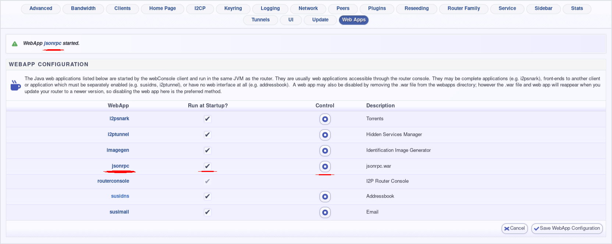

toopie.html I2P standalone monitoring panel
===========================================

This is a very simple monitoring panel for interacting with I2P and monitoring
I2P statistics. It can stop, or restart an I2P router, as well as provide concise
output about I2P router status from I2PControl. It depends on the presence of an
I2P router implementing the i2pcontrol jsonrpc interface.

To enable jsonrpc on the Java I2P router, go to this the webapps config page:
[http://localhost:7657/configwebapps](http://localhost:7657/configwebapps) and
enable the `jsonrpc` app as seen in the screenshot below:

HELP WANTED!!!
--------------

I don't have a Mac, mine bit the dust. I need help creating a Mac package
of this. Please, if you want a Mac version of this application and have
Mac packaging experience, create an issue so we can work together to figure
out how to support Mac users best.

